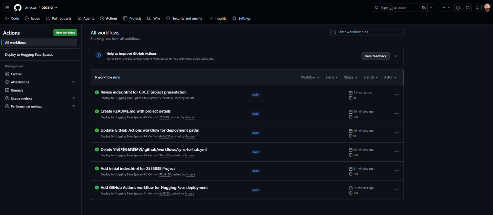

# CI/CD with GitHub Actions & Hugging Face Spaces

Student ID: 2555038  
Course: 인공지능모델운영  
Date: 2026.09.07

## Project Overview

This project demonstrates automatic deployment using GitHub Actions and Hugging Face Spaces.

Workflow:

Developer → GitHub → GitHub Actions → Hugging Face Spaces

## Hugging Face Space

[Open Hugging Face Space](https://huggingface.co/spaces/Arrsssa/2555038-2026.09.07)

## GitHub Actions

Successful deployment:

## Hugging Face Deployment

Running application:

